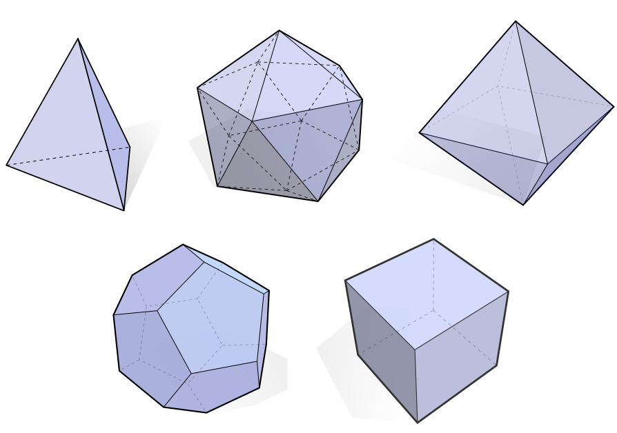
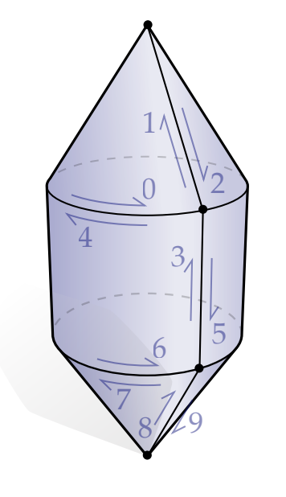
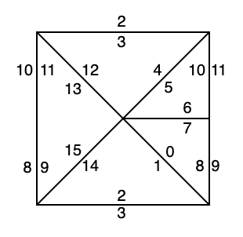

### EXERCISE 2.1 Euler’s Polyhedral Formula

Show for any **polygonal disk** with V vertices, E edges, and F faces, the following relationship holds: V − E + F = 1 and explain, then, why V − E + F = 2 for any **polygonal sphere**.

| Examples&nbsp;(V)                 | V − E + F (Polygonal disks)                                  | V − E + F (Polygonal spheres)                                |
| --------------------------------- | ------------------------------------------------------------ | ------------------------------------------------------------ |
| 1 (・)                            | 1 - 0 + 0 = 1                                                | 1 - 0 + 1 = 2                                                |
| 2 (—)                             | 2 - 1 + 0 = 1                                                | 2 - 1 + 1 = 2                                                |
| 3 (▲)                             | 3 - 3 + 1 = 1                                                | 3 - 3 + 2 = 2                                                |
| 4                                 | ◤+◢ ⇒◾️: 4 - 5 + 2 = 1 4 - 4 + 1 = 1 (merged)       | &ensp;&ensp;△ ⇒ ◬ ⇒  = ▲ x 4 = ▲ x 2 + △ x 2  ⇒◾️+ ▢:  4 - 6 + 4  = 2 4 - 4 + 2 = 2 (merged) |
| More                              | ◾️ + ▲ ⇒ ⬟:  5 - 6 + 2 = 1 5 - 5 + 1 = 1 (merged)   ⬟ + ▼ ⇒ ⬢:  6 - 7 + 2 = 1 6 - 6 + 1 = 1 (merged) | &ensp;&ensp; +  = ▲ x 6 = ▲ x 3 + △ x 3 ⇒◾️+ ▲ + ▢ + △  ⇒ ⬟ + ⬠:   5 - 9 + 6 = 2 5 - 5 + 2 = 2 (merged)  |
|                                   |                                                              |                                                              |
| **Insights**                      |                                                              |                                                              |
| Intuition                         | After merging all faces, the boundary V and E always pair off and there will be **only 1 interior face**. | • After "flattening" any polygonal sphere into a front polygonal disk plus a back face, • and merging all front faces, • the "boundary" V and E always pair off, with **2 faces left (1 front and 1 back)**. |
| Lemmas                            | Appending a triangle (adding 1 vertex, 2 edges, and 1 face) does not change the EC: (V + 1) - (E + 2) + (F + 1) = V - E + F  Merging two faces with a shared edge (subtracting 1 edge and 1 face) does not change the EC: V − (E - 1) + (F - 1) = V − E + F | Glueing a polyhedron onto a face (with vertices k) is the same as inserting a vertex inside the face and connecting the vertices up (adding 1 vertex, k edges, and k-1 faces), which does not change the EC:  (V + 1) − (E + k) + (F + k - 1) = V − E + F |
|                                   |                                                              |                                                              |
| **Proof**                         |                                                              |                                                              |
| Base cases                        | Examples above                                               | Examples above                                               |
| Assume it holds for a specifc n≥4 | Vn - En + Fn = 1            | Vn - En + Fn = 2            |
| Then for n+1                      | Incrementing V is the same as appending a triangle:  &emsp;Vn+1 - En+1 + Fn+1 =(Vn + 1) - (En + 2) + (Fn + 1) = Vn - En + Fn = 1 | Incrementing V is the same as glueing a polyhedron onto any face (with vertices k):  &emsp;Vn+1 - En+1 + Fn+1 =(Vn + 1) - (En + k) + (Fn + k - 1) = Vn - En + Fn = 2 |
| By mathematical induction         | The Euler Characteric = 1 holds for all polygonal disks with vertices n ∈ ℕ. | The Euler Characteric = 2 holds for all polygonal spheres with vertices n ∈ ℕ. |

---

### EXERCISE 2.2 Platonic Solids

These polyhedra are the Platonic solids: **tetrahedron, icosahedron, octahedron, dodecahedron, and cube**. Show that this list is indeed exhaustive. [[Wiki](https://www.wikiwand.com/en/Platonic_solid#/Topological_proof)]

Key Insight: `  pV = 2E = qF`, where p is the "number of edges meeting at each vertex" and q is the "number of edges of each face". ⇒ `(2E / p) - E + (2E / q) = 2`.
---

### EXERCISE 2.3 Regular Valence

Show that the only (connected, orientable) simplicial surface for which every vertex has regular valence is a torus (g = 1). [[Slide Page 20](https://pages.mtu.edu/~shene/COURSES/cs3621/SLIDES/Mesh.pdf)]

---

### EXERCISE 2.4 Minimum Irregular Valence

TODO

---

### EXERCISE 2.5 Mean Valence (Triangle Mesh)

Show that the mean valence approaches six as the number of vertices in a (connected, orientable) simplicial surface goes to infinity, and that the ratio of vertices to edges to triangles hence approaches V : E : F = 1 : 3 : 2.

TODO

---

### EXERCISE 2.6 Mean Valence (Quad Mesh)

Similar to the previous exercise, consider a quad mesh, i.e., a combinatorial surface made entirely out of four-sided quadrilaterials rather than three-sided triangles. Letting Q denote the number of quadrilaterals, give an expression for the ratio V : E : Q in the limit as the number of vertices approaches infinity

TODO

---

### EXERCISE 2.7 Mean Valence (Tetrahedral)

Letting V, E, F, and T be the number of vertices, edges, triangles, and tetrahedra in a manifold simplicial 3-complex, come up with a rough estimate for the ratios V : E : F : T as the number of elements goes to infinity.

TODO

---

### EXERCISE 2.8 Star, Closure, and Link

For the subset S indicated below in dark blue (consisting of three vertices, three edges, and two triangles), give the star St(S), the closure Cl(S), and the link Lk(S), either by drawing pictures or providing a list of simplices in each set. [Trivial after Coding Assignment 0]

---

### EXERCISE 2.9 Boundary and Interior

For the subset K' indicated above in dark blue (consisting of 12 vertices, 23 edges, and 12 triangles), give the boundary bd(K') and the interior int(K'), either by drawing pictures or providing a list of simplices in each set. [Trivial after Coding Assignment 0]

---

### EXERCISE 2.10 Surface as Permutation

For the combinatorial surface pictured below, give the twin and next permutations η and ρ (resp.) by filling out the following tables:

| h    | 0    | 1    | 2    | 3    | 4    | 5    | 6    | 7    | 8    | 9    |
| ---- | ---- | ---- | ---- | ---- | ---- | ---- | ---- | ---- | ---- | ---- |
| η(h) | 4    | 2    | 1    | 5    | 0    | 3    | 7    | 6    | 9    | 8    |
| ρ(h) | 1    | 2    | 0    | 4    | 5    | 6    | 3    | 9    | 7    | 8    |

---

### EXERCISE 2.11 Permutation as Surface

For the permutation ρ given below, describe the combinatorial surface it describes—either in words, or by drawing a picture. You should assume that η is determined as described in Section 2.5, i.e., the twin of an even halfedge h is h + 1; the twin of an odd halfedge h is h − 1.

| h    | 0    | 1    | 2    | 3    | 4    | 5    | 6    | 7    | 8    | 9    | 10   | 11   | 12   | 13   | 14   | 15   |
| ---- | ---- | ---- | ---- | ---- | ---- | ---- | ---- | ---- | ---- | ---- | ---- | ---- | ---- | ---- | ---- | ---- |
| ρ(h) | 8    | 2    | 14   | 4    | 12   | 6    | 10   | 0    | 7    | 15   | 5    | 9    | 3    | 11   | 1    | 13   |

It's a torus:

---

### EXERCISE 2.12 Surface as Matrices

Give the adjacency matrices A0 and A1 for the simplicial disk depicted in the figure below.

| A0                                                | A1                                                |
| ------------------------------------------------------------ | ------------------------------------------------------------ |
| 1 1 0 0 0  1 0 1 0 0  1 0 0 1 0  1 0 0 0 1  0 1 0 0 1  0 1 1 0 0  0 0 1 1 0  0 0 0 1 1 | 1 0 0 1 1 0 0 0  1 1 0 0 0 1 0 0  0 1 1 0 0 0 1 0  0 0 1 1 0 0 0 1     |

---

### EXERCISE 2.13 Classification of Simplicial 1-Manifolds

Explain why every simplicial 1-manifold (possibly with boundary) cannot contain anything other than paths of edges and closed loops of edges.

TODO

---

### EXERCISE 2.14 Boundary Loops

Explain why the boundary of any simplicial surface (i.e., any simplicial 2-manifold) always has to be a collection of closed loops?

TODO

---

### EXERCISE 2.15 Boundary Has No Boundary

Explain why the boundary bd(K) of a simplicial manifold has no boundary. In other words, why does bd(bd(K)) = ∅?

TODO